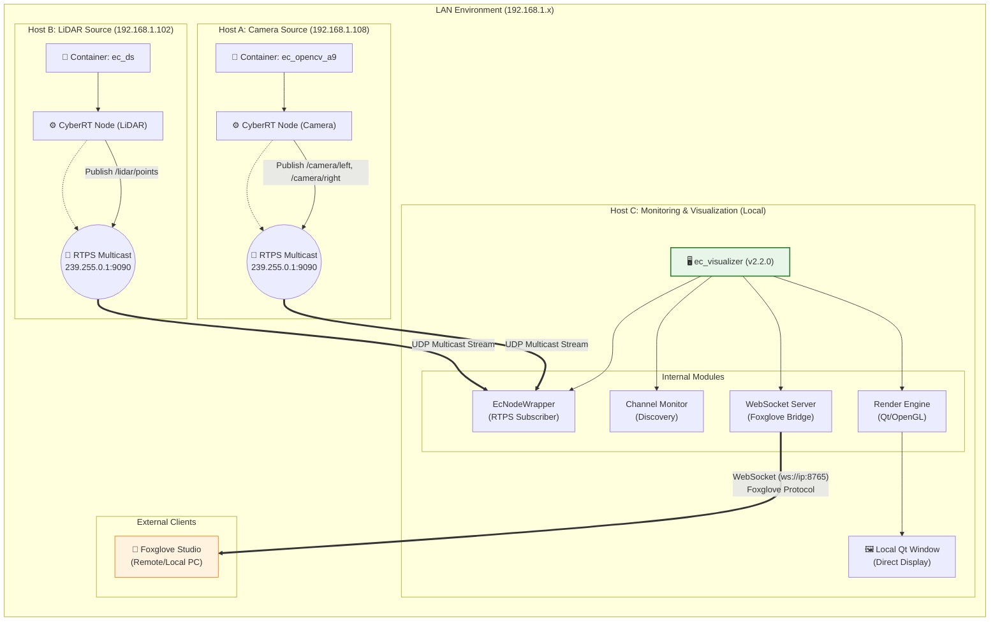

# ec_visualizer Deployment Architecture

## System Overview

## Key Components

1. **Data Plane**: RTPS multicast for real-time sensor data
2. **Control Plane**: WebSocket server for Foxglove integration
3. **Configuration**: Consistent cyber_conf.xml across all hosts